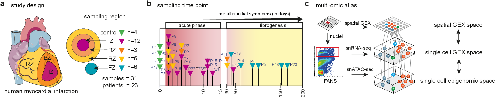

## Spatial multi-omic map of human myocardial infarction

Myocardial infarction is a leading cause of mortality worldwide. Here, we generate an integrative high-resolution map of human cardiac remodelling after myocardial infarction using single-cell gene expression, chromatin accessibility, and spatial transcriptomic profiling of multiple physiological zones at distinct time points in myocardium from myocardial infarction and control patients

